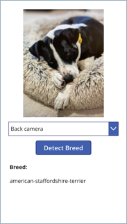
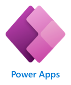

# Scenario: The Mutt Matcher (Power Apps version)

According to the World Health Organization there are more than 200 million stray dogs worldwide. The American Society for the Prevention of Cruelty to Animals estimates over 3 million dogs enter their shelters annually - about 6 dogs per minute! Anything that can reduce the time and effort to take in strays can potentially help millions of dogs every year.

Different breeds have different needs, or react differently to people, so when a stray or lost dog is found, identifying the breed can be a great help.

Your team has been asked by a fictional animal shelter to build **Mutt Matcher** - a mobile app to help determine the breed of a dog when it has been found. To help deliver this quickly, this will be a no-code app built using an on-line low/no-code app generation tool. This app will take a photo of the dog, and then use an image classifier Machine learning (ML) model to determine the breed, then show the breed in the app.

This app will help workers and volunteers to be able to quickly detect the breed and make decisions on the best way to approach and care for the dog.

The animal shelter has provided [a set of images](./model-images) for a range of dog breeds to get you started. These can be used to train the ML model using a service called Custom Vision.

## Prerequisites

Each team member will need an Azure account. With [Azure for Students](https://azure.microsoft.com/free/students/?WT.mc_id=academic-39324-jabenn), you can access $100 in free credit, and a large suite of free services!

Each team member will also need a Power Apps account, and you can sign up for a free developer plan. To sign up:

1. You will need a Microsoft 365 account. If you don't already have one, for example from your school, you can sign up for [the free M365 developer program](https://developer.microsoft.com/microsoft-365/dev-program?WT.mc_id=academic-39324-jabenn). You will need to activate your subscription and set up your new tenant and a new email address for that tenant. Once created, you can set up all the members of the team as users.

    > 💁 You can read more about signing up for the M365 developer program in the [Microsoft 365 Developer Program FAQ](https://docs.microsoft.com/office/developer-program/microsoft-365-developer-program-faq?WT.mc_id=academic-39324-jabenn).

1. Once your Microsoft 365 account is set up, you can then sign up for [the Power Apps developer plan](https://powerapps.microsoft.com/developerplan/?WT.mc_id=academic-39324-jabenn). You will need to log in using your M365 account, so if you set up an M365 developer program account then you will need to use the email address you created when you activated your subscription.

> 💁 All the members of your team should be using the same M365 tenant (same school, or all as different users of the same M365 developer program) so that you can work together on this app.

### Power Platform Browser Support

Users can access the model-driven apps with the most recent versions of these popular browsers:

- Microsoft Edge (based on Chromium)
- Chrome
- Firefox
- Safari

For more details on [supported browsers and troubleshooting](https://docs.microsoft.com/power-platform/admin/supported-web-browsers-and-mobile-devices?WT.mc_id=academic-39324-jabenn)

## Git and GitHub

Your team should also be familiar with the following:

  - [Forking](https://docs.github.com/github/getting-started-with-github/quickstart/fork-a-repo) 

  - [Cloning](https://docs.github.com/github/creating-cloning-and-archiving-repositories/cloning-a-repository-from-github/cloning-a-repository) 

  - If you have not used git before we suggest [GitHub Desktop](https://desktop.github.com/)

## Resources

A series of resources will be provided to help your team determine the appropriate steps for completion. The resources provided should provide your team with enough information to achieve each goal. These resources include appropriate links to documentation to learn more about the services you are using and how to do common tasks

If you get stuck, you can always ask a mentor for additional help.

## Exploring the application

  

The application your team will build will consist of 2 components:

- An image classifier running in the cloud using Microsoft Custom Vision

- A no-code based mobile app built using Microsoft Power Apps

- No-code back end logic built using Microsoft Power Automate

When a dog breed needs to be detected:

1. A button on the mobile app is tapped

1. The mobile app uses the devices camera to take a picture

1. The picture is sent to a no-code application flow, where it is then sent to the image classifier ML model in the cloud to detect the breed

1. The results of the classification are sent back to the mobile app and displayed

## Goals

Your team will train the ML model, build the mobile app, build the back end logic, then deploy to a mobile device and test.

> 💁 Each goal below defines what you need to achieve, and points you to relevant on-line resources that will show you how the cloud services or tools work. The aim here is not to provide you with detailed steps to complete the task, but allow you to explore the documentation and learn more about the services as you work out how to complete each goal.

1. [Train your ML model](train-model.md): Your team will need to train the ML model in the cloud using Microsoft Custom Vision. You can train and test this model using the images that have been provided by the animal shelter.

1. [Build your no/low-code back end](back-end.md): Your team will use Power Automate with the Custom Vision connector to build a Power Automate flow that can be called with an image. This flow will send the image to Custom Vision, and return the detected breed.

1. [Build your no/low-code mobile app](mobile-app.md): Your team will use Power Apps to build a mobile app. This app will interact with the camera, capture an image, send it to the Power Automate flow, then show the result.

## Validation

This workshop is designed to be a goal-oriented self-exploration of Azure and related technologies. Your team can validate the first goal using the supplied validation script, and instructions are provided where relevant. Your team can then validate the final solution by using the mobile app to take a picture of one of the provided testing images and ensuring the correct result is returned.

## Where do we go from here?

This project is designed as a potential seed for ideas and future development during your hackathon. Other hack ideas for similar mobile apps that use image classification include:

- Trash sorting into incineration/landfill, recycling, and compost.

- Identification of disease in plant leaves.

- Detecting skin cancer by classification of moles.

Improvements you could make to this application include:

- Adding a data store to save the count of breeds detected

- Adding access to your photos to check the breed in a saved image

### Learn more

You can learn more about using Custom Vision to train image classifiers and object detectors using the following resources:

- [Custom Vision documentation](https://docs.microsoft.com/azure/cognitive-services/custom-vision-service/?WT.mc_id=academic-39324-jabenn)

- [Custom Vision modules on Microsoft Learn, a free, hands-on, self-guided learning platform](https://docs.microsoft.com/users/jimbobbennett/collections/qe2ehjny7z7zgd?WT.mc_id=academic-39324-jabenn)

You can learn more about Power Apps using the following resources:

- [Power Apps documentation](https://docs.microsoft.com/power-automate/?WT.mc_id=academic-39324-jabenn)

- [Power Apps modules and learning paths on Microsoft Learn, a free, hands-on, self-guided learning platform](https://docs.microsoft.com/learn/powerplatform/power-apps?WT.mc_id=academic-39324-jabenn)

You can learn more about Power Automate using the following resources:

- [Power Automate documentation](https://docs.microsoft.com/powerapps/?WT.mc_id=academic-39324-jabenn)

- [Power Automate modules and learning paths on Microsoft Learn, a free, hands-on, self-guided learning platform](https://docs.microsoft.com/learn/powerplatform/power-automate?WT.mc_id=academic-39324-jabenn)

## Contributing

This project welcomes contributions and suggestions.  Most contributions require you to agree to a
Contributor License Agreement (CLA) declaring that you have the right to, and actually do, grant us
the rights to use your contribution. For details, visit https://cla.opensource.microsoft.com.

When you submit a pull request, a CLA bot will automatically determine whether you need to provide
a CLA and decorate the PR appropriately (e.g., status check, comment). Simply follow the instructions
provided by the bot. You will only need to do this once across all repos using our CLA.

This project has adopted the [Microsoft Open Source Code of Conduct](https://opensource.microsoft.com/codeofconduct/).
For more information see the [Code of Conduct FAQ](https://opensource.microsoft.com/codeofconduct/faq/) or
contact [opencode@microsoft.com](mailto:opencode@microsoft.com) with any additional questions or comments.

## Trademarks

This project may contain trademarks or logos for projects, products, or services. Authorized use of Microsoft
trademarks or logos is subject to and must follow
[Microsoft's Trademark & Brand Guidelines](https://www.microsoft.com/en-us/legal/intellectualproperty/trademarks/usage/general).
Use of Microsoft trademarks or logos in modified versions of this project must not cause confusion or imply Microsoft sponsorship.
Any use of third-party trademarks or logos are subject to those third-party's policies.
