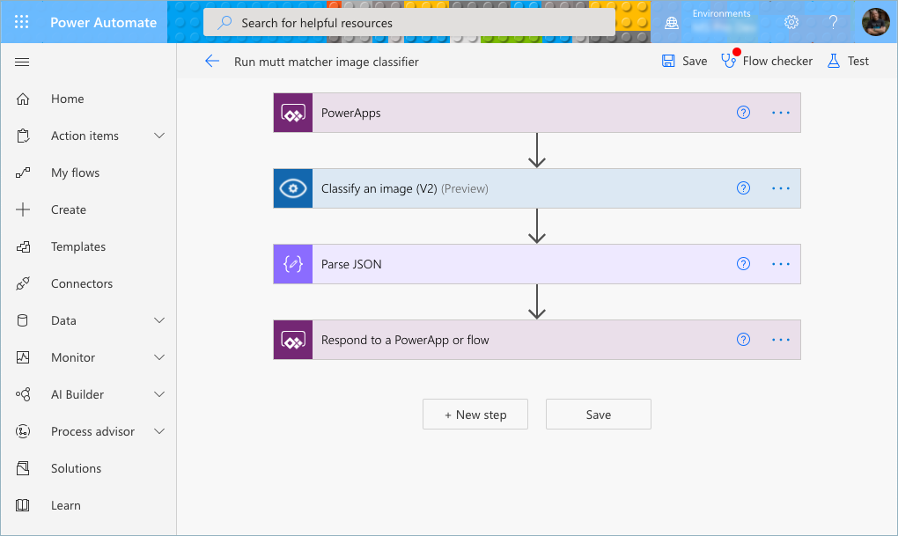
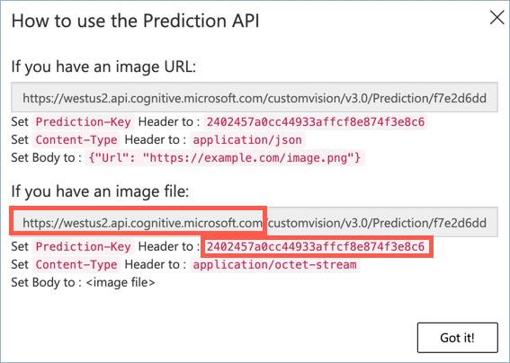
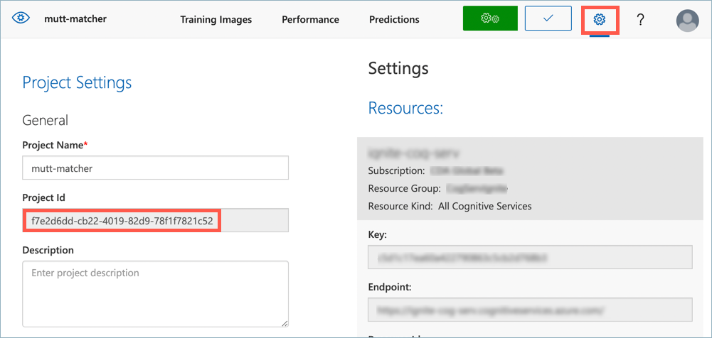

# Goal 1: Build your no/low-code back end

The **Mutt Matcher** needs to connect to your image classifier and classify an image, returning the result. To do this your team will need to build a no/low-code back end flow that is passed an image, sends it to the image classifier, and returns the top prediction.

The goal of this section is create a Power Automate flow to classify an image.

## The no/low-code Service

[](https://flow.microsoft.com/?WT.mc_id=academic-39324-jabenn)

[Microsoft Power Automate](https://flow.microsoft.com/?WT.mc_id=academic-39324-jabenn) is a tool for building automated processes using flow-chart style no/low-code development. You start by defining triggers that are run when events happen, such as when a Power Apps mobile app button is tapped, an email is received, a form is submitted, or at a certain time each day. You then define a flow of events that happen using logic blocks, or connectors to services such as Custom Vision, databases, IoT platforms, or productivity applications.



For this workshop, you will need a Power Automate flow that is called by a Power Apps mobile app button. This will be passed an image from the mobile devices camera. This image will then be passed to the Custom Vision connector to classify an image. After the image is classified, the tag with the highest probability will be returned.

## Success criteria

Your team will work together to create the Power Automate flow. Your team will have achieved this goal when the following success criteria is met:

- Your flow takes an image passed from Power Apps.

- Your flow is connected to Custom Vision using your image classifier, and passes the image from Power Apps converted to binary data.

- You have parsed the output from Custom Vision and returned the first prediction (the predictions are always returned in order of most probable to least probable).

## Resources

Your team might find these resources helpful:

- [Power Automate documentation](https://docs.microsoft.com/power-automate/?WT.mc_id=academic-39324-jabenn)

- [Create a cloud flow from a template in Power Automate documentation](https://docs.microsoft.com/power-automate/get-started-logic-template?WT.mc_id=academic-39324-jabenn#add-a-device)

- [Custom Vision (Preview) connector documentation](https://docs.microsoft.com/connectors/cognitiveservicescustomvision/?WT.mc_id=academic-39324-jabenn)

## Tips

- Use the Power Apps button template to get started

- When you use the Custom Vision connector, you will need to provide the following pieces of information:

  - Prediction key

  - Prediction root URL

  - Project ID

  - Published iteration name

  - Image content
  
  The *Prediction Key* and *Prediction URL* come from the **Prediction URL** dialog. For the URL, you just need the root part, ending in `microsoft.com` or `azure.com` depending on the resource used when it was created.

  

  In the dialog above, the root URL is `https://westus2.api.cognitive.microsoft.com`.

  The *Project ID* comes from the *Project Settings* for your Custom Vision project, available from the cog button.

  

  The *Published iteration name* is the name you used when you published the iteration.

- To pass the *Image content*, you will need to create *Dynamic content* that can be passed from the Power Apps mobile app. Images from the Power Apps mobile app camera are *base64 encoded*. Base64 encoding is a way to convert binary data into text that can be passed around applications. Before these images can be passed to Custom Vision, they need to be converted back to binary data. To do this:

    1. Select the *Image Content* field, then select **Add dynamic content**

    1. In the **Dynamic content** tab, select *Ask in PowerApps*. This will create a variable for the data passed in from the Power Apps, and it will default to something like `Classifyanimage(v2)_ImageContent`. The *Image content* will be set to this value.

    1. This value cannot be used directly, it needs to be converted from a base64 encoded string to binary data using the [`dataUriToBinary` function](https://docs.microsoft.com/azure/logic-apps/workflow-definition-language-functions-reference?WT.mc_id=academic-39324-jabenn#dataUriToBinary). Close the *Dynamic content* popup by selecting outside it, then select the `Classifyanimage(v2)_ImageContent` value inside the *Image content* box to allow you to edit this value.

    1. Select the **Expression** tab, then type `dataUriToBinary`, then select the function of that name that appears as you type, adding an open parentheses after the function name.

    1. Select the **Dynamic content** tab, then select the `Classifyanimage(v2)_ImageContent` variable to pass this to the `dataUriToBinary` function. The final expression should read:

        ```javascript
        dataUriToBinary(triggerBody()['Classifyanimage(V2)_ImageContent'])
        ```

    1. Select the **OK** button to update the value.

- The easiest way to handle the output of the Custom Vision connector is to use a Parse JSON action. The schema to use is:

    ```json
    {
        "type": "array",
        "items": {
            "type": "object",
            "properties": {
                "probability": {
                    "type": "number"
                },
                "tagId": {
                    "type": "string"
                },
                "tagName": {
                    "type": "string"
                }
            },
            "required": [
                "probability",
                "tagId",
                "tagName"
            ]
        }
    }
    ```

    This will convert the output of the Custom Vision connector to an array of objects. Pass the *Predictions* from the Custom Vision connector as the *Content*.

- The predictions returned by Custom Vision are always returned in order of most probable to least probable, so you only need to return the first one. You can get this using the [`first` function](https://docs.microsoft.com/azure/logic-apps/workflow-definition-language-functions-reference?WT.mc_id=academic-39324-jabenn#first), passing in the array output from the Parse JSON action. The tag will be the `tagName` property on the first item in the array.

- To return a value, you need to use the *Respond to a PowerApp or flow* action. Respond with text, passing the first prediction's `tagName` in a text field called `breed`.

## Final result


## Next challenge

The next goal is to [build your no-code mobile app](mobile-app.md).
