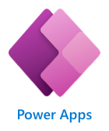

# Goal 2: Build your no/low-code mobile app

Your team has a trained ML model, and built a Power Automate flow to use it. The final task for your team is to create a Power Apps mobile app to capture an image from the camera and send it to the flow, showing the results.

## The no/low-code Service

The tool for building mobile apps with no/low-code is called [Microsoft Power Apps](https://powerapps.microsoft.com/?WT.mc_id=academic-39324-jabenn). You create an application by dragging/dropping controls onto a canvas, then adding code where necessary, such as code to call the Power Automate flow.

When you create a mobile app, it runs inside the Power Apps host app - you install Power Apps on your phone, then from inside that app you can access all the different apps you develop.

 

For this project, you will need to design an app that connects to the phones camera, captures an image on a button tap, sends the image to your Power Automate flow, then displays the result. You can design the app any way you like, taking advantage of all the design features to layout and style your app.

## Success criteria

Your team will work together to build the mobile app and connect it to your Power Automate flow. Your team will have achieved this goal when the following success criteria is met:

- You have a mobile app with a camera and a button to tap to capture an image

- The button is connected to your Power Automate flow, sending the image from the camera

- The results from the Power Automate flow are visible in the app

- Your app has been saved and shared, and is available in the Power Apps mobile app

## Resources

Your team might find these resources helpful:

- [Power Apps documentation](https://docs.microsoft.com/power-automate/?WT.mc_id=academic-39324-jabenn)

- [Camera control in Power Apps documentation](https://docs.microsoft.com/powerapps/maker/canvas-apps/controls/control-camera?WT.mc_id=academic-39324-jabenn)

- [Button control in Power Apps documentation](https://docs.microsoft.com/powerapps/maker/canvas-apps/controls/control-button?WT.mc_id=academic-39324-jabenn) 

- [Run model-driven apps and canvas apps on Power Apps mobile documentation](https://docs.microsoft.com/powerapps/mobile/run-powerapps-on-mobile?WT.mc_id=academic-39324-jabenn)

## Validation

Have a mentor check your mobile app. They should be able to point your model device at an one of the training images loaded on a screen, select the Detect Breed button, then see the correct breed prediction in the app.

## Tips

- To create a blank app, [create a Canvas app](https://docs.microsoft.com/powerapps/maker/?WT.mc_id=academic-39324-jabenn).

- You can test your app inside Power Apps, using your computers camera. Either select the **Preview the app** button, or hold the `Alt` key in the designer to test your app.

- Phones have multiple cameras, so you may want to add a drop down to select between the front and back cameras, or if you only want to use one camera make sure the correct one is selected.

- The camera control captures photos in one of two ways:

  - When you tap the camera, the `Photo` property is updated

  - You can set the `StreamRate` property to automatically capture images on a regular basis into the `Stream` property.

  To use an image when a button is tapped, it is easiest to use the `Stream` property. This property will only have an image if the `StreamRate` is set to a valid value in milliseconds, such as 100 (100ms means it will capture images 10 times a second).

- When you add your Power Automate flow to your app, the app will gather information about it, including the return type. You can use this to see the properties on the result, which should be a single property called `breed` with the breed (if you used a different name in the *Respond to a PowerApp or flow* action then this property will match that name).

- To update a label, set a variable with the result of the call to the Power Automate flow in the buttons `OnSelect` event, and set the label to this variable. Every time the variable is updated, the label will be updated.

## Final result

