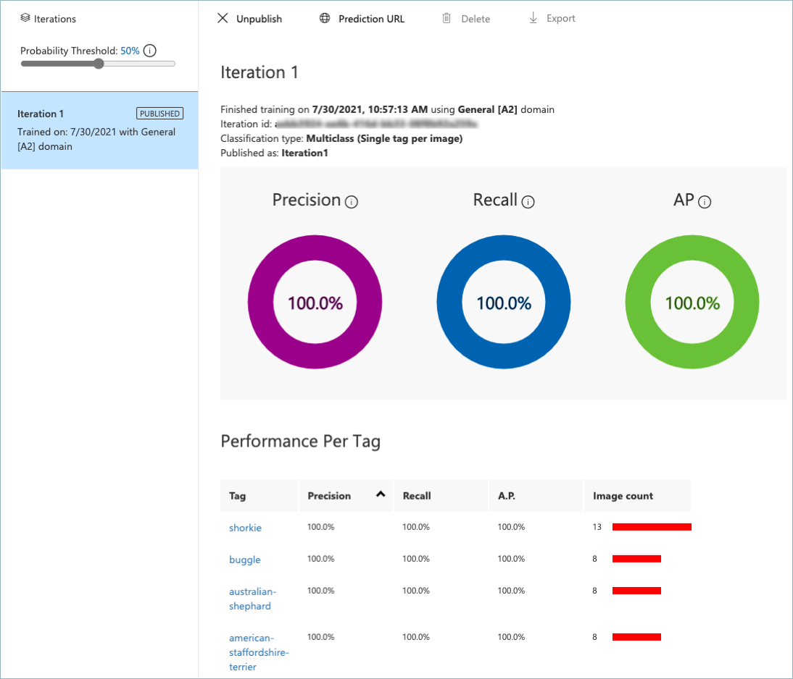

# Goal 0: Train your ML model

The **Mutt Matcher** app will need to use a machine learning (ML) model to be able to detect different dog breeds in images. The ML model used is an *image classifier* - a model that can classify an image into different *tags* depending on what is in the image. These models are trained by giving them tagged images - multiple images for each tag. For example, you can train a model with images tagged as `cat`, and images tagged as `dog`. The model can then be given a new image and it will predict if the image should be a `cat` or a `dog`.

A typical image classifier needs many thousands if not millions of images to train, but you can take a shortcut using a technique called *transfer learning*. Transfer learning allows to take an image classifier trained on a wide range of tags, then re-train it using a small number of images for your tags.

Your team will use a cloud service that uses transfer learning to train an ML model to identify different dog breeds using images provided by the fictional animal shelter. These training images consist of a number of images of a range of breeds. You would use these to train the model, using the breed as the tag.

> ⏱ Training a model can take a while, so you can work on this concurrently with the other goals in the workshop.

## The Azure Service

[](https://customvision.ai?WT.mc_id=academic-39324-jabenn)

The transfer learning service to use is [Custom Vision](https://customvision.ai?WT.mc_id=academic-39324-jabenn). This is a service from Microsoft that can train image classifiers using only a small number of images for each tag. Once your model has been trained, it can be published to be run in the cloud, using one of the Custom Vision SDKs for programming languages such as Python, Java or C#, via a REST API, or access from Power Automate using a Custom Vision connection. You can also download your model and run it locally on an IoT device, a web page, or in an application.


Image classifiers don't give a single fixed answer of the detected tag, instead they provide a list of all the tags that the model has been trained on with the probability that the image matches that tag. In the image above, the results show values against each tag:

| Tag                            | Probability |
| ------------------------------ | ----------: |
| american-staffordshire-terrier |       69.8% |
| german-wirehaired-pointer      |       28.2% |
| buggle                         |        1.6% |
| shorkie                        |        0.2% |
| australian-shepherd            |        0.0% |

To use Custom Vision, you will need an [Azure for Students subscription](https://azure.microsoft.com/free/students/?WT.mc_id=academic-39324-jabenn). Custom Vision has a generous free tier, so this workshop will not use any of your Azure credit.

## Image files

The images you can use to train your model are in the [model-images](./model-images) folder. You will need to clone this GitHub repo (or download it as a zip file) to access these images. The images are in 2 different folders:

- [training-images](./model-images/training-images) - these are the images to use to train the model. The filename contains the tag for the image, along with a number to make the files uniquely named. For example, `american-staffordshire-terrier-1.jpg`, `american-staffordshire-terrier-1.jpg`, and `american-staffordshire-terrier-3.jpg` are all images for the tag `american-staffordshire-terrier`.

- [testing-images](./model-images/testing-images) - these are images you can use to test the image classifier once it is trained. These are different from the training images.

> ⚠️ It is important that when you tag these images, you use the tag from the file name. This will allow teh validation script to work.

## Success criteria

Your team will work together to train the ML model using the training images, then test it with the testing images. Your team will have achieved this goal when the following success criteria is met:

- Your model has been trained on all the images in the `training-images` folder.

- You have verified that the `testing-images` have the correct tags detected as the highest probability tag using the *Quick test* button.

- Your model has a published iteration.

## Validation

You can validate your model using a Python script inside this repo.

1. From wherever you cloned this repo, navigate to the `validation` folder.

1. Create and activate a Python 3 virtual environment. If you've not done this before, you can refer to the [Python creation of virtual environments documentation](https://docs.python.org/3/library/venv.html).

1. Install the Pip packages in the `requirements.txt` file using the following command from inside the activated virtual environment:

    ```sh
    pip install -r requirements.txt
    ```

1. Run the validation script using the following command:

    ```sh
    python validate-model.py
    ```

1. When prompted, enter the prediction key and the image file URL for your published model iteration. You can get these from the prediction API dialog from the **Prediction URL** button of the published iteration. You then need the *Image file* url and prediction key.

    

This validation script will take the testing images, and test them against the model to ensure the correct tag is found as the most probable. You will see output like the following:

```output
(.venv) ➜  validation git:(main) ✗ python validate-model.py
ML model validation

What is your prediction key?
xxxxxxxxxxxxxxxxxxxxxxxxxxxx
What is your prediction URL?
https://xxxxxxx.cognitiveservices.azure.com/customvision/v3.0/Prediction/xxxxxxxx-xxxx-xxxx-xxxx-xxxxxxxxxx/classify/iterations/Iteration1/image
..........
Validation passed!
```

## Resources

Your team might find these resources helpful:

- [Quickstart: Build a classifier with the Custom Vision website](https://docs.microsoft.com/azure/cognitive-services/custom-vision-service/getting-started-build-a-classifier?WT.mc_id=academic-39324-jabenn)

- [Use your model with the prediction API](https://docs.microsoft.com/azure/cognitive-services/custom-vision-service/use-prediction-api?WT.mc_id=academic-39324-jabenn)

- [Classify images learning module on Microsoft Learn](https://docs.microsoft.com/learn/modules/classify-images/?WT.mc_id=academic-39324-jabenn)

## Tips

- When you create the training and prediction resource, use the **Free F0** tier, as this is free to use!

- You **MUST** set the tags to be the breed name from the image file name. The validation script assumes this is the case.

- When you train, use *Quick training*.

- The training can take a while - even with quick training, so whilst your model is training, work on the other goals.

## Final result



## Next challenge

The next goal is to [build your no-code back end](back-end.md).
